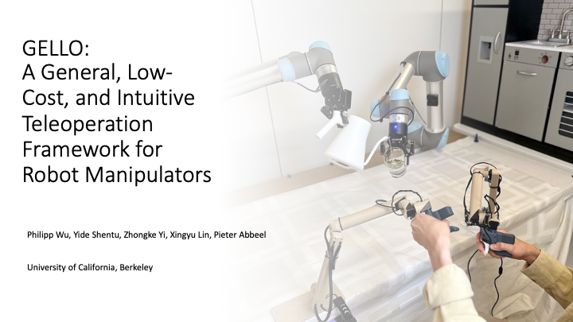
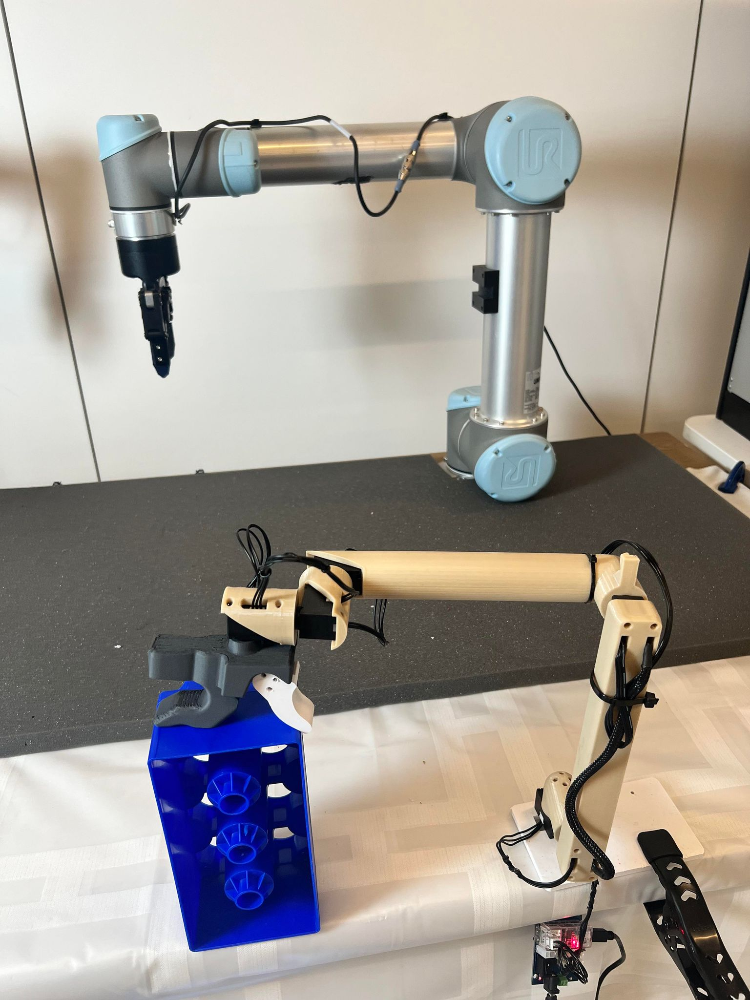
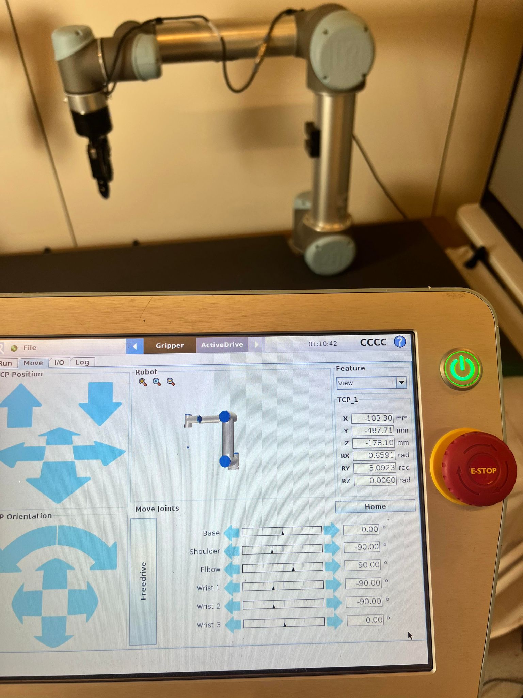
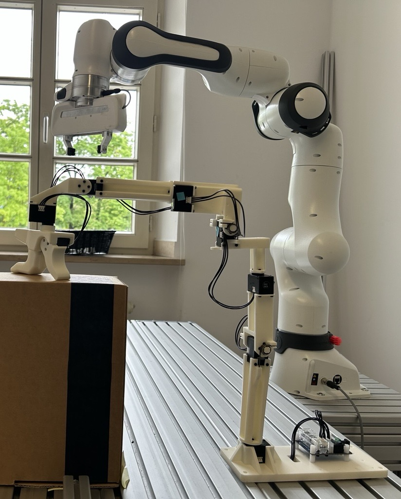
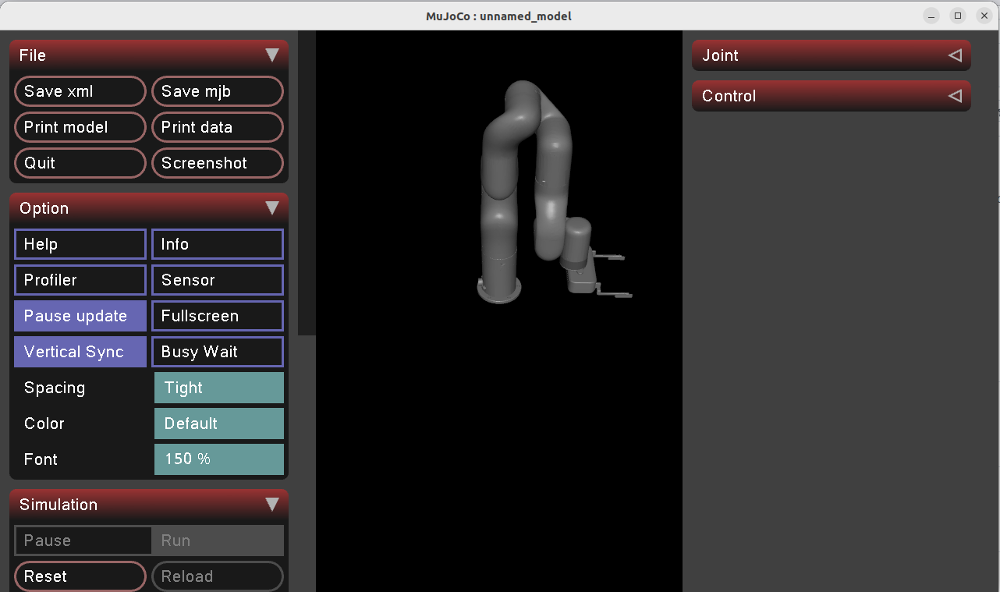

## Based On
This project is based on [gello_software](https://github.com/wuphilipp/gello_software), which was modified for adding ufactory xarm6.
Original repository by [@wuphilipp](https://github.com/wuphilipp).


# GELLO
This is the modified central repo that holds the all the software for GELLO + UFactory xArm6 software. See the website for the paper and other resources for GELLO https://wuphilipp.github.io/gello_site/
See the GELLO hardware repo for the STL files and hardware instructions for building your own GELLO https://github.com/wuphilipp/gello_mechanical
```
git clone https://github.com/humjie/gello_software_for_xarm6.git
cd gello_software_for_xarm6
```

<p align="center">
  
</p>


## Use your own enviroment
```
git submodule init
git submodule update
pip install -r requirements.txt
pip install -e .
pip install -e third_party/DynamixelSDK/python
```

## Use with Docker / ROS 2
For Docker or ROS2, please refer to [gello_software](https://github.com/wuphilipp/gello_software).

# GELLO configuration setup (PLEASE READ)
Now that you have downloaded the code, there is some additional preparation work to properly configure the Dynamixels and GELLO.
These instructions will guide you on how to update the motor ids of the Dynamixels and then how to extract the joint offsets to configure your GELLO.

## Update motor IDs
Install the [dynamixel_wizard](https://emanual.robotis.com/docs/en/software/dynamixel/dynamixel_wizard2/).
By default, each motor has the ID 1. In order for multiple dynamixels to be controlled by the same U2D2 controller board, each dynamixel must have a unique ID.
This process must be done one motor at a time. Connect each motor, starting from the base motor, and assign them in increasing order until you reach the gripper.

Steps:
 * Connect a single motor to the controller and connect the controller to the computer.
 * Open the dynamixel wizard
 * Click scan (found at the top left corner), this should detect the dynamixel. Connect to the motor
 * Look for the ID address and change the ID to the appropriate number.
 * Repeat for each motor

## Create the GELLO configuration and determining joint ID's
After the motor ID's are set, we can now connect to the GELLO controller device. However each motor has its own joint offset, which will result in a joint offset between GELLO and your actual robot arm.
Dynamixels have a symmetric 4 hole pattern which means there the joint offset is a multiple of pi/2.
The `GelloAgent` class  accepts a `DynamixelRobotConfig` (found in `gello/agents/gello_agent.py`). The Dynamixel config specifies the parameters you need to find to operate your GELLO. Look at the documentation for more details.

We have created a simple script to automatically detect the joint offset:
* set GELLO into a known configuration, where you know what the corresponding joint angles should be. For example, we set our GELLO for the UR and Franka FR3 in this configuration, where we know the desired ground truth joints (0, -90, 90, -90, -90, 0), or (0, 0, 0, -90, 0, 90 , 0) respectively.
<p align="center">
  
  
  
</p>

* For the UR run 
```
python scripts/gello_get_offset.py \
    --start-joints 0 -1.57 1.57 -1.57 -1.57 0 \ # in radians
    --joint-signs 1 1 -1 1 1 1 \
    --port /dev/serial/by-id/usb-FTDI_USB__-__Serial_Converter_FT7WBG6
# replace values with your own
```
* For the Franka FR3 run
```
python scripts/gello_get_offset.py \
    --start-joints 0 0 0 -1.57 0 1.57 0 \ # in radians
    --joint-signs 1 1 1 1 1 1 \
    --port /dev/serial/by-id/usb-FTDI_USB__-__Serial_Converter_FT7WBG6
# replace values with your own
```
* For the UFactory xArm6 run
```
python scripts/gello_get_offset.py \
    --start-joints 1.571 3.142 4.712 3.142 0 1.571 \ # in radians
    --joint-signs 1 1 1 1 1 -1 1 \
    --port /dev/serial/by-id/usb-FTDI_USB__-__Serial_Converter_FT7WBG6
# replace values with your own
```
* Use the known starting joints for `start-joints`.
* Depending on the mechanical setup of your GELLO, the joint signs can flip, so you need to specify them for each axis.
* Use your serial port for `port`. You can find the port id of your U2D2 Dynamixel device by running `ls /dev/serial/by-id` and looking for the path that starts with `usb-FTDI_USB__-__Serial_Converter` (on Ubuntu). On Mac, look in /dev/ and the device that starts with `cu.usbserial`

`joint-signs` for each robot type:
* UR: `1 1 -1 1 1 1`
* Panda: `1 -1 1 1 1 -1 1`
* FR3: `1 1 1 1 1 -1 1`
* xArm7: `1 1 1 1 1 1 1`
* xArm6: `1 1 1 1 1 1`

The script prints out a list of joint offsets. Go to `gello/agents/gello_agent.py` and add a DynamixelRobotConfig to the PORT_CONFIG_MAP. You are now ready to run your GELLO!

# Using GELLO to control a robot!

The code provided here is simple and only relies on python packages. The code does NOT use ROS, but a ROS wrapper can easily be adapted from this code.
For multiprocessing, we leverage [ZMQ](https://zeromq.org/)

## Testing in sim
First test your GELLO with a simulated robot to make sure that the joint angles match as expected.
In one terminal run
```
python experiments/launch_nodes.py --robot sim_xarm6
```
or
```
env _NV_PRIME_RENDER_OFFLOAD=1 __GLX_VENDOR_LIBRARY_NAME=nvidia python experiments/launch_nodes.py --robot sim_xarm6
```
This launched the robot node. A simulated robot using the mujoco viewer should appear.

<p align="center">
  
</p>

Then, launch your GELLO (the controller node).
```
python experiments/run_env.py --agent=gello
```
You should be able to use GELLO to control the simulated robot!

Start pose of gello xarm6 and simulation
<p align="center">
  
</p>

Demo of controlling simulation through gello xarm6
[Watch demo video](imgs/real&sim_demo.mp4)

## Running on a real robot.
Once you have verified that your GELLO is properly configured, you can test it on a real robot!

Before you run with the real robot, you will have to install a robot specific python package.
The supported robots are in `gello/robots`.
 * xArm: [xArm python SDK](https://github.com/xArm-Developer/xArm-Python-SDK)

```
# Launch all of the node
python experiments/launch_nodes.py --robot=xarm6
# run the enviroment loop
python experiments/run_env.py --agent=gello
```

Ideally you can start your GELLO near a known configuration each time. If this is possible, you can set the `--start-joint` flag with GELLO's known starting configuration. This also enables the robot to reset before you begin teleoperation.

## Collect data
We have provided a simple example for collecting data with gello.
To save trajectories with the keyboard, add the following flag `--use-save-interface`

Data can then be processed using the demo_to_gdict script.
```
python gello/data_utils/demo_to_gdict.py --source-dir=<source dir location>
```

## Notes
Due to the use of multiprocessing, sometimes python process are not killed properly. We have provided the kill_nodes script which will kill the
python processes.
```
./kill_nodes.sh
```

### Structure
The code is organized as follows:
 * `scripts`: contains some helpful python `scripts`
 * `experiments`: contains entrypoints into the gello code
 * `gello`: contains all of the `gello` python package code
    * `agents`: teleoperation agents
    * `cameras`: code to interface with camera hardware
    * `data_utils`: data processing utils. used for imitation learning
    * `dm_control_tasks`: dm_control utils to build a simple dm_control enviroment. used for demos
    * `dynamixel`: code to interface with the dynamixel hardware
    * `robots`: robot specific interfaces
    * `zmq_core`: zmq utilities for enabling a multi node system

# Citation

```
@misc{wu2023gello,
    title={GELLO: A General, Low-Cost, and Intuitive Teleoperation Framework for Robot Manipulators},
    author={Philipp Wu and Yide Shentu and Zhongke Yi and Xingyu Lin and Pieter Abbeel},
    year={2023},
}
```

# License & Acknowledgements
This source code is licensed under the MIT license found in the LICENSE file. in the root directory of this source tree.

This project builds on top of or utilizes the following third party dependencies.
 * [google-deepmind/mujoco_menagerie](https://github.com/google-deepmind/mujoco_menagerie): Prebuilt robot models for mujoco
 * [brentyi/tyro](https://github.com/brentyi/tyro): Argument parsing and configuration
 * [ZMQ](https://zeromq.org/): Enables easy create of node like processes in python.
